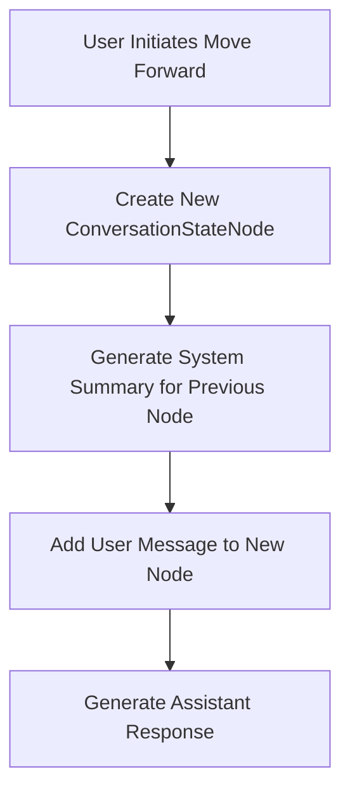
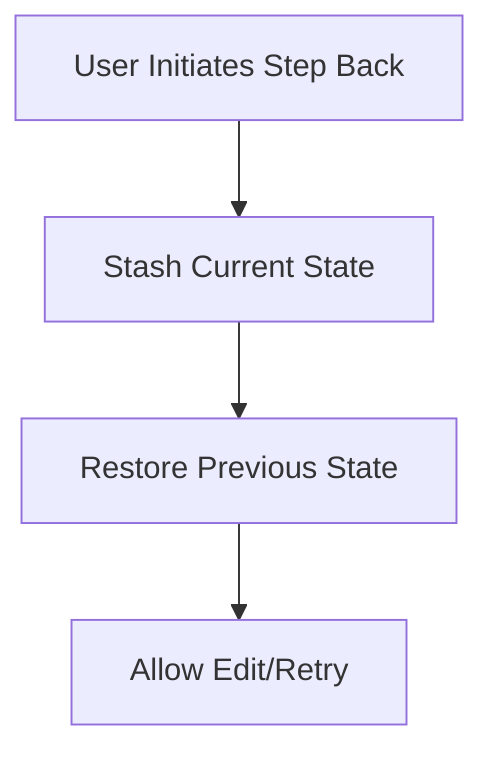
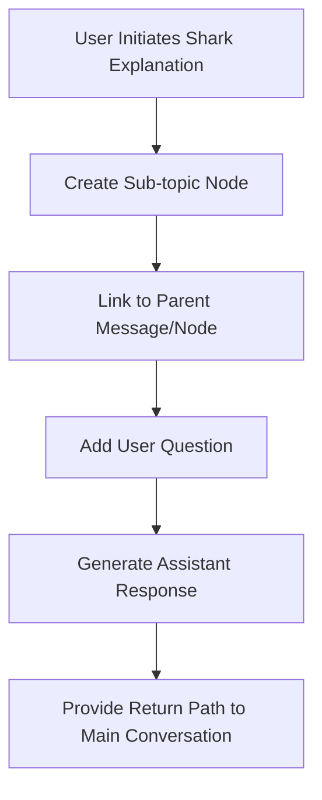
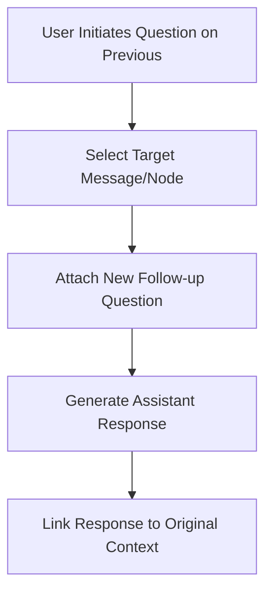

# Dataflow Actions

## Move Forward

```mermaid
graph TD
    A[User Initiates Move Forward] --> B[Create New ConversationStateNode]
    B --> C[Generate System Summary for Previous Node]
    C --> D[Add User Message to New Node]
    D --> E[Generate Assistant Response]
```

## Step Back

```mermaid
graph TD
    A[User Initiates Step Back] --> B[Stash Current State]
    B --> C[Restore Previous State]
    C --> D[Allow Edit/Retry]
```

## Shark Explanation

```mermaid
graph TD
    A[User Initiates Shark Explanation] --> B[Create Sub-topic Node]
    B --> C[Link to Parent Message/Node]
    C --> D[Add User Question]
    D --> E[Generate Assistant Response]
    E --> F[Provide Return Path to Main Conversation]
```

## Question on Previous

```mermaid
graph TD
    A[User Initiates Question on Previous] --> B[Select Target Message/Node]
    B --> C[Attach New Follow-up Question]
    C --> D[Generate Assistant Response]
    D --> E[Link Response to Original Context]
```
